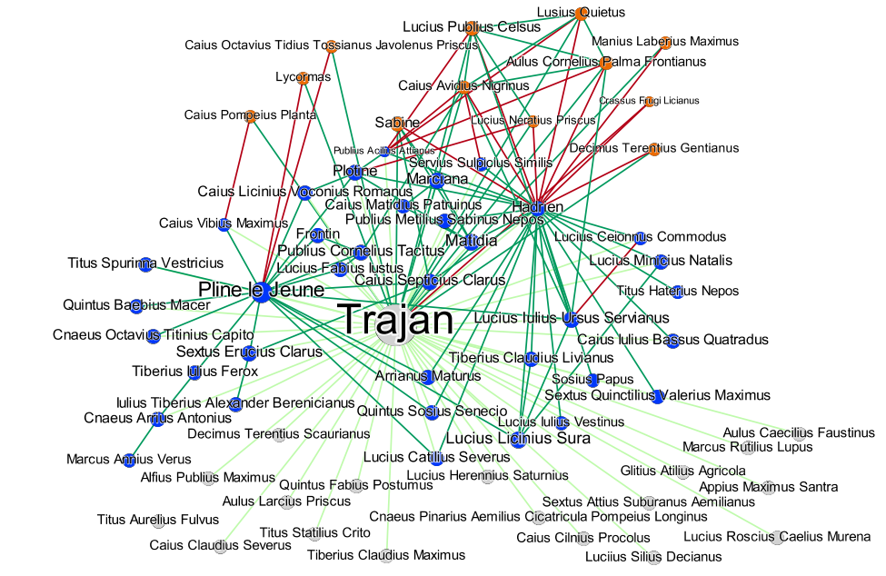

TrajanNet
=======
*Extraction and analysis of a [Trajan](https://en.wikipedia.org/wiki/Trajan)-related social network*

* Copyright 2019-2020 Vincent Labatut 

TrajanNet is free software: you can redistribute it and/or modify it under the terms of the GNU General Public License as published by the Free Software Foundation. For source availability and license information see `licence.txt`

* Lab site: http://lia.univ-avignon.fr/
* GitHub repo: https://github.com/CompNet/NetVotes
* Contact: Vincent Labatut <vincent.labatut@univ-avignon.fr>

**Currently in development**

-----------------------------------------------------------------------

# Description
This set of R scripts aims at analyzing a historical dataset describing the relationships between the Roman emperor Trajan and his entourage. It does the following:

1. Extracts various networks based on some tabular data containing individual and relational attributes.
2. Computes a number of statistics and generates the corresponding plots, for both the tables and graphs.
3. Performs a sequence analysis of certain chronological attributes.

# Data
The raw dataset was manually elaborated by Gaëtane Vallet during her Master's thesis in ancient history. See her thesis (in French) for more information [V'18,V'20].

# Organization
Here are the folders composing the project:
* Folder `data`: contains the data used by the R scripts, as well as produced by them.
  * Folder `tables`: input data presented as the following CSV tables
    * `trajan_attributes.csv`: individual description of each historical character in the dataset.  
    * `trajan_careers.csv`: careers of the character, described as sequences of positions.  
    * `trajan_positions.csv`: list of professional positions a character can hold.  
    * `trajan_relations.csv`: connections between the characters.  
    * `trajan_typical_careers.csv`: ideal careers, described as sequences of positions.  
  * Folder `nets`: networks procuded by the scripts, and the associated plots and tables.
    * Folder `all`: network containing all the types of links at once (multiplex signed network).
    * Folder `family`: network with only the family ties (uniplex signed network).
    * Folder `friend`: network with only the friendship ties (uniplex unsigned network).
    * Folder `pro`: network with only the professional ties (uniplex signed network).
    * Folder `unknown`: network with relationships whose exact nature is unknown (uniplex signed network). 
    * Folder `signed`: signed network with no distinction between relationship types (signed collapsed multiplex network).
      * Folder `na-as-positive*`: network obtained by considering the links whose sign is unknown as positive ones.
      * Folder `na-as-ignored*`: network obtained by discarding the links whose sign is unknown.
      * Folder `*-closure`: closure of the signed network obtained using *strong* structural balance.
      * Folder `*-closure-poly`: closure of the signed network obtained using *weak* structural balance.
  * Folder `attributes`: descriptive results obtained for the individual attributes.
  * Folder `sequences`: descriptive results obtained for the individual attributes.
    * Folder `withNAs`: gaps in careers are explicitly represented as missing values.
    * Folder `withoutNAs`: gaps in careers are not represented at all.
* Folder `src`: contains the `R` source code.

# Installation
1. Install the [`R` language](https://www.r-project.org/)
2. Download this project from GitHub and unzip.
3. Install the required packages: 
   1. Open the `R` console.
   2. Set the current directory as the working directory, using `setwd("<my directory>")`.
   3. Run the install script `src/install_packages.R`.

# Use
In order to extract the networks from the raw data, compute the statistics, and generate the plots:

1. Open the `R` console.
2. Set the current directory as the working directory, using `setwd("<my directory>")`.
3. Run the main script `src/main.R`.

The script will produce a number of files in the subfolders of folder `nets`. They are grouped in subsubfolders, each one corresponding to a specific topological measure (degree, closeness, etc.). 

The `verification.R` was used to check the consistency of the raw data. The rest of the scripts are just secondary functions called by `main.R`.

# Dependencies
* [`igraph`](http://igraph.org/r/) package: build and handle graphs.
* [`signnet`](https://github.com/schochastics/signnet): analysis of signed graphs.
* [`graphlayouts`](https://cran.rstudio.com/web/packages/graphlayouts): plot graphs.
* [`ggraph`](https://cran.rstudio.com/web/packages/ggraph): plot graphs.
* [`TraMineR`](http://traminer.unige.ch/): sequence analysis.
* [`SDMTools`](https://cran.rstudio.com/web/packages/SDMTools): misc.
* [`scales`](https://cran.rstudio.com/web/packages/scales): color conversion.
* [`circlize`](https://cran.rstudio.com/web/packages/scales): circos-type plots.
* [`plot.matrix`](https://cran.rstudio.com/web/packages/scales): matrix plots.
* [`alluvial`](https://cran.rstudio.com/web/packages/scales): alluvial diagrams.
* [`cluster`](https://cran.rstudio.com/web/packages/scales): cluster analysis.
* [`dendextend`](https://cran.rstudio.com/web/packages/scales): dendrogram-related features.

# To-do List
* Signed nets: 
  * Consider the evolution of the relationships
  * Synchronous closure, separate the different steps until complete graph
* Structural similarity between spanish / the rest (and other attributes)
* Multiplex plot of the different types of links (Didn't find an appropriate tool)

# References
* **[V'20]** Vallet, G. *Les princes et les hommes : carrières et réseaux dans l’entourage de Trajan de 98 à 118 après J.-C.*, G. Second part of the Master's thesis, Avignon University, Human and Social Sciences Faculty, History Department, Avignon, France.
* **[V'18]** Vallet, G. *L'entourage de Trajan : étude prosopographique de l'entourage du prince de 98-117 apr. J.-C.*, First part of the Master's thesis, Avignon University, Human and Social Sciences Faculty, History Department, Avignon, France.
